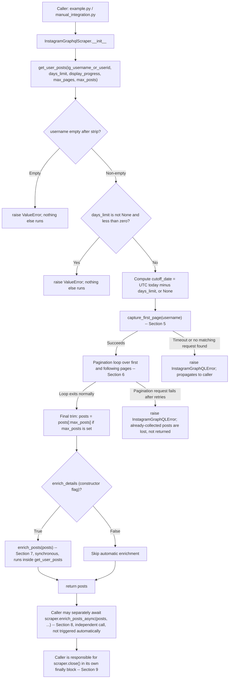
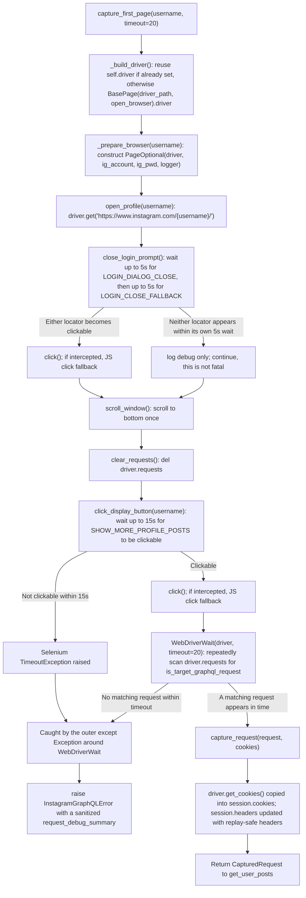
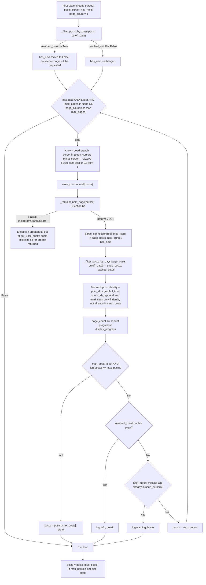
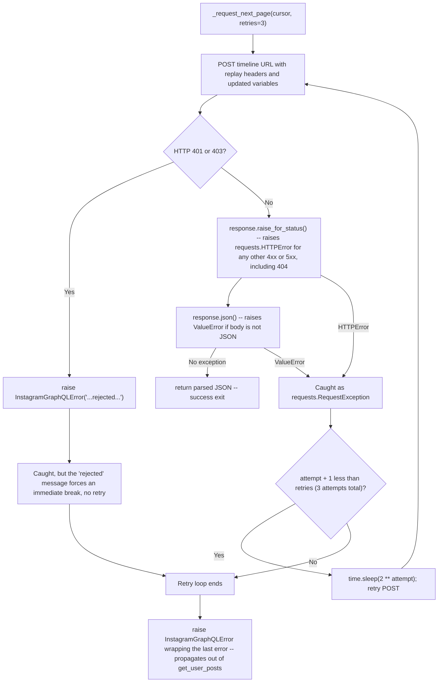
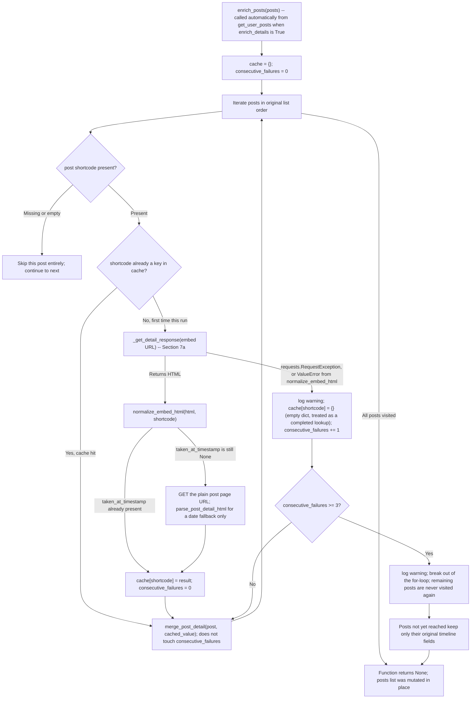
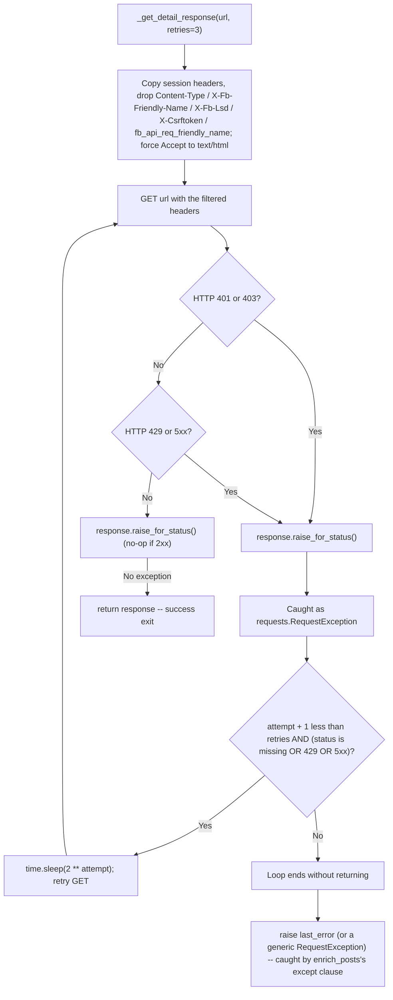
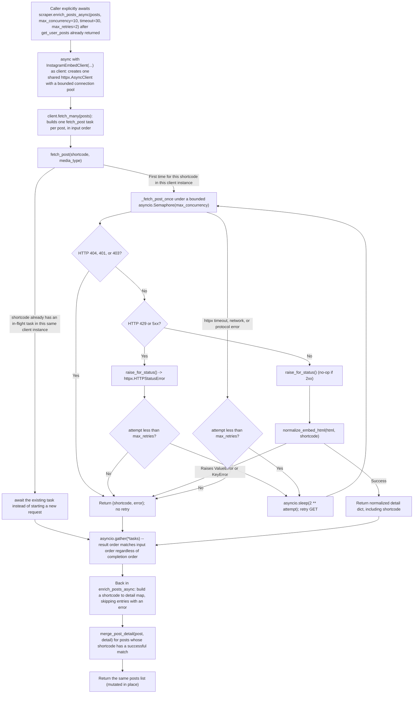

# Instagram GraphQL Scraper — 執行流程說明

## 一、目的與適用範圍

本文件描述 `InstagramGraphqlScraper` 目前實際的執行邏輯，包括瀏覽器啟動、第一頁 GraphQL 擷取、分頁、日期篩選、貼文去重、同步／非同步詳細資料補齊，以及回傳結果與資源清理。

內容以下列原始碼為唯一依據，逐行核對後撰寫：

- `scraper.py`
- `graphql.py`
- `embed.py`
- `detail.py`
- `instagram_context_json.py`
- `pages/page_optional.py`
- `base/base.py`
- `models.py`
- `example.py`
- `manual_integration.py`
- `tests/test_graphql.py`

本文件只描述「目前已實作的行為」。尚未實作、僅是可能改善方向的內容，統一列在「潛在問題與改善建議」段落，並清楚標示尚未實作。

## 二、主要入口

實際使用方式（`example.py`、`manual_integration.py`）：

```python
from instagram_graphql_scraper import InstagramGraphqlScraper

scraper = InstagramGraphqlScraper(driver_path="...", open_browser=False)
try:
    posts = scraper.get_user_posts(
        ig_username_or_userid="username",
        days_limit=90,
        display_progress=True,
        max_pages=2,
        max_posts=None,
    )
finally:
    scraper.close()
```

`InstagramGraphqlScraper` 沒有實作 `__enter__` / `__exit__`，不能用 `with` 語法自動關閉資源；`close()` 必須由呼叫端自行呼叫（`scraper.py:333-338`）。

## 三、參數設定位置與預設值

| 名稱 | 設定位置 | 預設值 | 說明 |
| --- | --- | --- | --- |
| `driver_path` | 建構子 `__init__` | `None` | Selenium ChromeDriver 路徑，未提供時交給 Selenium Manager 解析 |
| `open_browser` | 建構子 `__init__` | `False` | 是否停用 headless 模式 |
| `driver` | 建構子 `__init__` | `None` | 若提供，`close()` 不會呼叫 `driver.quit()`（見第八節） |
| `ig_account` / `ig_pwd` | 建構子 `__init__` | `None` | 有值時才會嘗試登入 |
| `enrich_details` | 建構子 `__init__` | `True` | 是否在 `get_user_posts` 結尾自動呼叫同步 `enrich_posts` |
| `ig_username_or_userid` | `get_user_posts` 參數 | 必填 | `str(...).strip()` 後不可為空字串，否則 `raise ValueError`（`scraper.py:176-178`） |
| `days_limit` | `get_user_posts` 參數 | `None` | 見第五節；負數會 `raise ValueError`（`scraper.py:179-180`） |
| `display_progress` | `get_user_posts` 參數 | `False` | 只影響是否 `print` 進度，不影響停止條件 |
| `max_pages` | `get_user_posts` 參數 | `None` | 見第四節 |
| `max_posts` | `get_user_posts` 參數 | `None` | 見第四節 |

`max_pages`、`max_posts`、`days_limit`、`enrich_details` 沒有集中設定檔，全部是函式參數或建構子屬性，沒有其他隱藏預設值來源。

`enrich_posts_async` 的 `max_concurrency`（預設 `10`）、`timeout`（預設 `30`）、`max_retries`（預設 `2`）是該方法自己的參數，與 `enrich_details` 無關（`scraper.py:271-276`）。

## 四、總覽流程圖



## 五、第一頁擷取（`capture_first_page`）



`is_target_graphql_request`（`graphql.py:265-286`）判斷條件：

1. HTTP method 是 `POST`。
2. URL path 等於 `/api/graphql`。
3. `response` 存在且狀態碼為 2xx。
4. form payload 可解析、`variables` 是合法 JSON、response 可解出 `data.node.polaris_ordered_timeline_connection`。

只要以上四點成立就會回傳 `True`；`X-Fb-Friendly-Name` 或 `fb_api_req_friendly_name` 與 `OPERATION_NAME` 不一致時，只會記一筆 `logger.warning`，**不會**造成比對失敗。也就是說目前的比對主要依賴 URL、方法與 response schema，operation name 只是輔助訊號，不是必要條件。

## 六、分頁迴圈（`get_user_posts` 內的 `while`）



補充說明（原始碼確認）：

- 去重鍵優先順序固定為 `post_id` → `graphql_id` → `shortcode`（`scraper.py:187`, `202`），三者皆缺時 identity 會是 `None`；此時第二筆同樣缺欄位的貼文會被誤判為重複而遺失，見第十節第 2 點。
- `max_posts` 計算的是「日期篩選後、去重後」的 `posts` 長度，不是原始 edge 數量。
- `max_pages` 包含第一頁：`page_count` 從 `1` 開始，迴圈條件為 `page_count < max_pages`，所以 `max_pages=2` 代表第一頁加最多一次額外分頁，`max_pages=0` 與 `max_pages=1` 效果相同（只用第一頁）。
- 若第一頁就觸發 `reached_cutoff`，`has_next` 會被設為 `False`，迴圈條件立即為假，**不會**再多送出一次分頁請求（已用本機模擬驗證，見第十二節）。
- 沒有 `accessibility_caption` 或日期解析失敗的貼文會被保留在結果中，且不會觸發 `reached_cutoff`（`graphql.py:189-207`、`scraper.py:225-238`）。

### 六之一、`_request_next_page` 重試策略



重要行為（原始碼確認，`scraper.py:128-155`）：

- 只有 401 / 403 會立即失敗、不重試。
- 429、5xx，以及**其他任何 4xx（包含 404）**與非 JSON 回應，都會被視為可重試，最多重試到滿 3 次嘗試為止；耗盡後才 `raise`。這與第七之一節「詳細頁面重試」的策略不同（那裡的 404 是立即失敗），兩者並非同一套規則。
- 重試耗盡後會直接 `raise`，`get_user_posts` 沒有 `try/except` 包住這段呼叫，例外會直接往外傳給呼叫端；此時本次呼叫已經收集到的貼文（例如前面幾頁）不會被回傳，也不會有任何「部分成功」的回傳值。

## 七、同步詳細資料補齊（`enrich_posts`）

只有在建構子 `enrich_details=True`（預設值）時，才會在 `get_user_posts` 結尾自動呼叫。



重要行為（本機模擬已驗證，見第十二節）：

- 快取以 `shortcode` 為鍵，只存在於單次 `enrich_posts` 呼叫的區域變數，不跨呼叫、不跨貼文清單保留。
- 同一 `shortcode` 第二次出現時是「快取命中」，不會再發 HTTP 請求，也**不會**影響 `consecutive_failures` 計數。
- `consecutive_failures` 只在「本次是新 shortcode 且請求或解析失敗」時遞增，達到 `3` 就中止整個迴圈；已經處理過的貼文結果保留，尚未處理到的貼文維持原始 timeline 欄位，不會被丟棄。
- 失敗時 `cache[shortcode]` 存入的是空字典 `{}`，不是清空整個 `cache`；空字典等同「這個 shortcode 已經查過、沒有資料」，之後同一 shortcode 再出現會直接命中這個空結果，不會重新嘗試。
- `merge_post_detail`（`detail.py:167-188`）只在 `post` 對應欄位為 `None` 時才會填入 `detail` 的值，缺不覆蓋已存在的值；並且只有 `detail` 本身有該欄位時才會設定，因此 `video_duration`、`video_url`、`like_count_is_approximate`、`comment_count_is_approximate`、`detail_source` 等欄位在補資料失敗或未執行補資料時，可能完全不存在於回傳的 `post` dict 中（不是 key 存在但值為 `None`）。

`normalize_embed_html` 會先解析 embed `contextJSON`。若其中的
`like_count` 或 `comment_count` 仍為 `None`，則使用同一份已取得的 HTML，
依序嘗試 embedded structured data、metadata，最後才以
`a[data-log-event="likeCountClick"]` 與
`a[data-log-event="captionCommentsClick"]` 作為精確數值 fallback。anchor
文字不限定語系，數字可含千分位、空白、換行或巢狀標籤；兩個欄位分別判斷，
只填補 `None`，因此既有有效值與 integer `0` 都不會被覆蓋。這段 fallback
直接解析既有 embed response，不會為相同 embed URL 再發一次請求。

### 七之一、`_get_detail_response` 重試策略



與分頁重試的差異：這裡的重試條件明確限定在「沒有狀態碼（連線層錯誤）、429、或 5xx」；一般的 4xx（例如 404）不在重試條件內，會立即結束重試迴圈並拋出，由 `enrich_posts` 的 `except` 接住、記為一次 `consecutive_failures`（`scraper.py:260-297`）。

## 八、非同步詳細資料補齊（`enrich_posts_async` / `InstagramEmbedClient`）

`enrich_posts_async` 是 `InstagramGraphqlScraper` 上的獨立 `async` 方法，**不會**被 `get_user_posts` 自動呼叫；README 範例與現有測試都是呼叫端在 `get_user_posts` 回傳後另外自行 `await` 這個方法，或直接使用 `InstagramEmbedClient` / `fetch_posts_embed`。目前 repository 內沒有任何測試直接呼叫 `scraper.enrich_posts_async`，只有 `InstagramEmbedClient` 本身被測試覆蓋（`tests/test_graphql.py` 內以 `httpx.MockTransport` 驗證）。



與同步路徑的差異（原始碼確認，非猜測）：

- 沒有「連續失敗達到門檻即中止」的機制；每一篇貼文都會各自嘗試、互不影響（`embed.py:79-129`）。
- 沒有同步路徑的「`taken_at_timestamp` 缺失時再抓一次一般貼文頁面補日期」邏輯；`normalize_embed_html` 會在 contextJSON 解析失敗，或 contextJSON 的 likes/comments 缺失時，使用同一份 embed HTML 執行 fallback。整個非同步流程只對 embed URL 發一次請求，不會像同步路徑一樣針對缺 timestamp 再多發一次一般頁面請求。
- 任務去重（`_tasks` 字典）只在單一 `InstagramEmbedClient` 執行個體、單次 `fetch_many` 呼叫的存活期間有效；`enrich_posts_async` 每次呼叫都會建立新的 `InstagramEmbedClient`（`async with`），結束時透過 `__aexit__` 呼叫 `aclose()` 關閉內部持有的 `httpx.AsyncClient`；`_tasks` 字典本身沒有顯式清空，但隨物件生命週期結束一併釋放。
- 若外部自行傳入 `client=` 給 `InstagramEmbedClient`，物件不會擁有該 client（`_owns_client=False`），結束時不會關閉它，需由外部自行管理。

## 九、回傳結果與資源生命週期

`get_user_posts` 回傳 `list[dict]`；保證存在的欄位由 `normalize_edge`（`graphql.py:144-172`）決定：

```text
post_id, graphql_id, shortcode, post_url, caption, accessibility_caption,
typename, media_type, product_type, is_video, display_uri,
carousel_media_count, username, user_pk, user_graphql_id, edge_cursor,
like_count, comment_count, video_view_count, taken_at_timestamp, published_at
```

這些欄位一定存在（值可能是 `None`）。以下欄位只有在補資料成功合併時才會被加入該筆 `post` dict，補資料未執行或失敗時可能完全不存在：

```text
video_duration, video_url, like_count_is_approximate,
comment_count_is_approximate, detail_source
```

資源清理：

- `close()`（`scraper.py:333-338`）是獨立方法，`get_user_posts` 內部不會呼叫它。
- `get_user_posts`、`capture_first_page`、`_request_next_page`、`enrich_posts` 都沒有使用 `try/finally` 包住 driver 或 session；如果例外在這些函式內拋出並往外傳遞，driver 與 session **不會**被自動關閉。
- 目前 repository 內的呼叫端（`example.py`、`manual_integration.py`）都是自行用 `try/finally: scraper.close()` 包住呼叫，資源清理完全是呼叫端的責任，不是函式庫內部保證的行為。
- 若建構子傳入外部 `driver=`，`close()` 不會呼叫 `driver.quit()`（因為 `_owns_driver=False`），只會關閉 `requests.Session`。

## 十、與原始 `flow_chart.mmd` 的差異

| 原圖描述 | 實際行為 | 原始碼位置 | 本次文件修正方式 |
| --- | --- | --- | --- |
| 沒有畫出 `days_limit` 負數驗證 | `days_limit < 0` 會 `raise ValueError`，發生在建立 cutoff 之前、瀏覽器啟動之前 | `scraper.py:179-180` | 於總覽流程圖新增對應節點 |
| `CheckCursorSeen{"Cursor repeated?"}` 畫成一個會生效的判斷 | `if cursor in seen_cursors - {cursor}` 在集合運算上必定為 `False`（已用本機模擬驗證），這個分支實際上永遠不會觸發；真正的重複 cursor 判斷是迴圈尾端的 `next_cursor in seen_cursors` | `scraper.py:194-196`、`215-216` | 分頁子流程圖將此分支明確標示為「Known dead branch」，並在文字中說明真正生效的檢查點 |
| `RetryCheck{"Status 429/5xx?"}` 暗示只有 429/5xx 會重試 | 分頁重試以 `response.raise_for_status()` 攔截「任何」4xx/5xx（401/403 除外），包含 404 與非 JSON 回應都會被重試 | `scraper.py:128-155` | 新增「六之一」子流程圖，明確列出可重試與立即失敗的條件 |
| `DetailRetry{"HTTP error/429/5xx?"}` 與分頁重試共用同一種語意 | 詳細頁面重試（`_get_detail_response`）只在「無狀態碼、429、5xx」時重試，一般 4xx（含 404）立即失敗；與分頁重試策略不同 | `scraper.py:298-323` | 新增「七之一」子流程圖並在文字中對照差異 |
| 把 `enrich_posts_async` 畫成 `get_user_posts` 流程的一個「Async Alternative」分支，暗示由同一次呼叫自動選擇 | `enrich_posts_async` 不會被 `get_user_posts` 呼叫，是呼叫端在取得 `posts` 之後另外、獨立呼叫的 `async` 方法 | `scraper.py:271-296` | 總覽圖改為「Caller may separately await」，並在第八節整段獨立說明 |
| `EnrichLoop`、`CacheCheck`、`FailLimitCheck` 分支標籤使用 `Yes/No` 但語意不同（例如 `DetailRetry -->|No/Success|`、`AsyncRetry -->|Success/Fail|`） | 各分支語意應分開標示，避免同一個 `Yes/No` 對應不同結果 | 全篇 | 新版所有分支改為描述性標籤，例如「reached_cutoff is True／False」、「cache hit／first time this run」 |
| 沒有畫出「第一頁即 reached_cutoff 時是否還會多抓一頁」 | 第一頁篩選後若 `reached_cutoff` 為真，`has_next` 直接設為 `False`，迴圈條件當次即為假，不會再送出下一頁請求 | `scraper.py:190-193` | 分頁子流程圖新增此節點並在文字補充說明，已用本機模擬確認 |
| 沒有畫出分頁失敗會讓已收集資料一併遺失 | `_request_next_page` 重試耗盡後 `raise`，`get_user_posts` 沒有攔截，已收集的 `posts` 不會被回傳 | `scraper.py:198` 與呼叫鏈 | 總覽圖與分頁子流程圖均新增此例外出口，已用本機模擬確認 |
| 沒有畫出補資料合併欄位（`video_duration`、`video_url` 等）可能完全不存在於回傳結果中 | `merge_post_detail` 只在 `detail` 有該欄位時才設定，欄位可能整個不存在，不是「存在但為 None」 | `detail.py:167-188` | 於第九節列出「保證存在」與「可能不存在」兩組欄位 |
| 沒有畫出 `close()` 由呼叫端負責 | `get_user_posts` 內沒有呼叫 `close()`，所有清理都在 `example.py` / `manual_integration.py` 的 `finally` 區塊 | `scraper.py:333-338`、`example.py`、`manual_integration.py` | 總覽圖與第九節明確標示 |

## 十一、驗證範圍與方法

- 原始碼審查：`scraper.py`、`graphql.py`、`embed.py`、`detail.py`、`instagram_context_json.py`、`pages/page_optional.py`、`base/base.py`、`models.py`、`example.py`、`manual_integration.py` 全篇逐行核對。
- 測試確認：執行 `python3 -m pytest -q`，結果 `28 passed`（本機執行，非猜測）。既有測試涵蓋 `parse_connection`、`is_target_graphql_request`、`capture_request`、`days_limit` 過濾、`parse_post_detail_html`、`normalize_media`、`InstagramEmbedClient` 的 order/dedup/retry/failure 行為；但**沒有**任何測試直接呼叫 `InstagramGraphqlScraper.enrich_posts` 或 `enrich_posts_async` 本身（只測試它們呼叫的底層函式）。
- 本機模擬驗證（未連線 Instagram，使用假造的 request/response 物件）：
  1. 確認第一頁觸發 `reached_cutoff` 時不會送出第二次分頁請求。
  2. 確認 `post_id`／`graphql_id`／`shortcode` 皆缺失時，第二筆貼文會被誤判為重複而遺失（見第十二節第 2 點）。
  3. 確認 `enrich_posts` 中，重複 `shortcode`（快取命中）不會觸發新的網路請求，也不會影響連續失敗計數；達到 3 次連續失敗後，後續貼文完全未被處理但保留在回傳列表中。
  4. 確認分頁請求失敗且重試耗盡後，例外會直接拋出，先前已收集的貼文不會被 `get_user_posts` 回傳。
- 未驗證項目：本次沒有對 Instagram 進行任何實際連線測試（沒有啟動 Selenium、沒有對 `instagram.com` 發送 HTTP 請求）。因此 `close_login_prompt`、`click_display_button` 等 Selenium 定位器在目前 Instagram 頁面上是否仍然有效、以及 `is_target_graphql_request` 在真實流量下是否仍然穩定，本次未做連線驗證，僅完成原始碼審查。
- Mermaid 語法本身沒有透過實際渲染器驗證；本文件已避免在節點文字中使用會與 Mermaid 語法衝突的字元（例如未轉義的花括號、反引號），並統一使用雙引號包住節點文字，但仍建議在目標渲染環境（例如 GitHub 或 VS Code 內建 Mermaid 預覽）中實際開啟本檔案確認顯示效果。

## 十二、程式潛在問題與改善建議（非本次修改範圍）

以下項目只做記錄與建議，不在本次變更中修改任何執行邏輯。

1. **分頁迴圈開頭的重複 cursor 檢查是死碼。**
   - 位置：`scraper.py:194-196`。
   - 觸發條件：任何情況都會觸發（該分支的判斷式在數學上恆為假）。
   - 影響：目前沒有實際影響，因為迴圈尾端還有另一個有效的重複 cursor 檢查（`scraper.py:215-216`）作為安全網；但這段程式碼本身不會執行任何作用，維護者可能誤以為它有效。
   - 建議：修正為 `cursor in seen_cursors`（在 `seen_cursors.add(cursor)` 之前檢查），或直接移除這段死碼，改為完全依賴迴圈尾端的檢查。

2. **貼文識別欄位（`post_id`／`graphql_id`／`shortcode`）全部缺失時，去重邏輯可能誤刪不同貼文。**
   - 位置：`scraper.py:187`、`202-205`。
   - 觸發條件：同一次 `get_user_posts` 呼叫中，出現兩筆以上這三個欄位皆為 `None` 的貼文（已用本機模擬重現：兩筆貼文只剩 1 筆）。
   - 影響：正常 Instagram timeline 貼文通常都會有 `pk` 或 `code`，發生機率低，但若 Instagram 回傳的 edge 結構异常缺欄位，會有貼文被靜默遺失且沒有任何警告或錯誤。
   - 建議：識別鍵為 `None` 時改用其他 fallback（例如 `edge_cursor`）或直接記錄警告並保留該筆貼文，而不是套用同一份 `seen_posts` 去重規則。

3. **分頁重試（`_request_next_page`）與詳細頁面重試（`_get_detail_response`）對「哪些狀態碼可以重試」的定義不一致。**
   - 位置：`scraper.py:128-155`（分頁）對照 `scraper.py:298-323`（詳細頁面）。
   - 觸發條件：Instagram 針對分頁請求回應一般 4xx（例如 404、400）時，分頁邏輯仍會重試到滿 3 次嘗試；但同一種狀態碼發生在詳細頁面請求時會立即失敗、不重試。
   - 影響：行為不一致可能讓除錯與效能評估更困難，也代表分頁對明顯不可重試的錯誤（例如帳號不存在造成的 404）仍會多花 2 次重試與對應的 `time.sleep` 等待時間。
   - 建議：統一制定「哪些狀態碼視為暫時性錯誤」的規則，讓兩處重試邏輯共用同一個判斷函式。

4. **`days_limit` 判斷完全依賴 timeline 的 `accessibility_caption` 日期，補資料階段取得的精確時間戳不會回頭套用篩選。**
   - 位置：`scraper.py:190-238`（篩選發生於分頁階段）對照 `scraper.py:241-296`（補資料發生於分頁結束之後）。
   - 觸發條件：某篇貼文在 timeline 階段沒有可解析的 `accessibility_caption` 日期（因此不會觸發 `reached_cutoff`），但後續補資料流程從 Embed／一般頁面取得了精確的 `taken_at_timestamp`。
   - 影響：`days_limit` 的停止時機只反映 timeline 當下可取得的粗略日期，不會因為之後取得更精確的時間而重新評估是否應該停止或排除該篇貼文；這只會影響「停止時機的精準度」，不會讓已回傳的貼文被誤刪。
   - 建議：若需要以精確時間作為 `days_limit` 的依據，需要將補資料時機提前到篩選之前，或在補資料後另外執行一次二次篩選；這是架構層級的調整，不建議在不確認需求前貿然更動。

5. **`days_limit` 提前停止假設 timeline 嚴格依時間新到舊排序，未特別處理置頂貼文。**
   - 位置：`scraper.py:190-238`。
   - 觸發條件：若 Instagram 在某一頁回傳的貼文中夾雜比 `cutoff_date` 更舊的置頂貼文，而該頁其餘貼文仍然較新。
   - 影響：篩選本身只會移除「單篇」早於 cutoff 的貼文（不影響同頁其他較新貼文），但只要當頁出現任何一篇早於 cutoff 的貼文，就會停止抓取後續分頁，可能提早結束、遺漏原本應該存在於下一頁的較新貼文。
   - 建議：若確認 Instagram 會回傳置頂貼文，需要額外排除置頂旗標後再判斷是否 `reached_cutoff`；目前原始碼沒有處理置頂貼文的欄位或邏輯。

6. **分頁請求失敗時沒有「部分成功」回傳路徑，與補資料階段的容錯設計不一致。**
   - 位置：`scraper.py:128-155`、`176-222`。
   - 觸發條件：任何一次分頁請求在重試耗盡後仍失敗。
   - 影響：即使已經成功收集多頁貼文，只要下一頁請求最終失敗，整個 `get_user_posts` 呼叫就會拋出例外、不回傳任何貼文；這與 `enrich_posts` 的「單篇補資料失敗不影響其他貼文」設計理念不同。
   - 建議：視需求評估是否要在分頁失敗時改為記錄警告並回傳目前已收集的貼文，而不是整批拋棄；這屬於行為變更，需要事先確認是否符合預期。

7. **`enrich_posts` 與 `enrich_posts_async` 目前沒有自動化測試直接覆蓋。**
   - 位置：`scraper.py:241-296`；比對 `tests/test_graphql.py` 現有測試清單。
   - 觸發條件：這兩個方法內部呼叫鏈（`_get_detail_response`、`normalize_embed_html`、快取、連續失敗計數、非同步合併）目前只能透過它們呼叫的底層函式（`parse_post_detail_html`、`normalize_media`、`InstagramEmbedClient`）間接驗證。
   - 影響：修改 `enrich_posts` 或 `enrich_posts_async` 本身的邏輯時，沒有直接測試可以立即抓到回歸問題。
   - 建議：之後若要調整這兩個方法，建議先補上針對方法本身（而非只針對其依賴函式）的測試，例如以 mock 的 `_get_detail_response` 驗證快取、連續失敗、提早中止等行為（本文件第十二節第 3 點的本機模擬即可作為測試雛形）。
