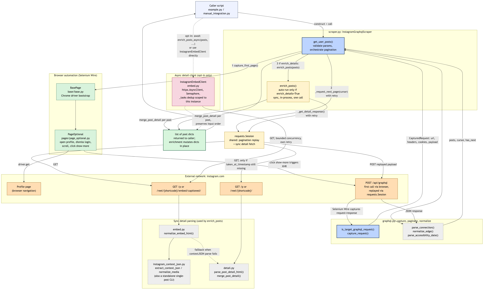
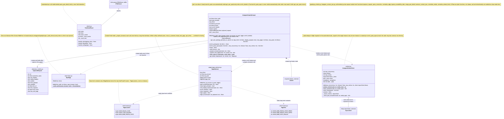

<div align="right">

**English** · [繁體中文](sre_testing_runbook.md)

</div>

# SRE Testing Runbook — Instagram GraphQL Scraper

> **Purpose**: Operations, testing, and troubleshooting runbook for `instagram-graphql-scraper`.
> **Audience**: Engineers maintaining this scraper, and SREs who need to verify or debug its behavior.
> **Scope**: `InstagramGraphqlScraper` (`scraper.py`), `InstagramEmbedClient` (`embed.py`), and their dependencies `graphql.py`, `detail.py`, `instagram_context_json.py`, and the browser layer (`base/base.py`, `pages/page_optional.py`, `utils/locator.py`).
> **Verified against**: commit `4e31b83` (`feat: implement date-limited Instagram pagination`), Python `3.13.1`, `python3 -m pytest -q` → `28 passed` (run locally while this document was written).
> **Evidence tags** used throughout this document:
> - **[Source-confirmed]**: derived directly from reading the file and line numbers cited.
> - **[Test-confirmed]**: covered by an existing test in `tests/test_graphql.py`.
> - **[Local-simulation-confirmed]**: reproduced locally with mocked request/response objects, no connection to Instagram.
> - **[Unverified]**: would require a live connection to Instagram; not exercised this round.
> - **[Improvement suggestion]**: not implemented yet, listed only as a direction to consider.

---

## 1. System Architecture and Class Diagram

### Architecture diagram

Source: [system_architecture.mmd](system_architecture.mmd) — Rendered:



**Key points** (all **[Source-confirmed]**):

- The caller (`example.py` / `manual_integration.py`) constructs `InstagramGraphqlScraper` and calls `get_user_posts()`. The library itself has no CLI or long-running service entry point.
- The first-page GraphQL request is **intercepted** by Selenium Wire after the browser clicks "show more posts"; the library does not assemble that payload itself.
- Subsequent pages reuse the same `requests.Session`, replaying the captured headers and payload while only replacing `variables.after`.
- Synchronous enrichment (`enrich_posts`) and asynchronous enrichment (`enrich_posts_async` / `InstagramEmbedClient`) both call the embed page and the plain post page, but they are **not the same code path**; their retry and fallback rules differ (see sections 7 and 8).
- There is **no persistent storage anywhere** (no database, no Redis, no on-disk cache). Every "cache" or "dedup set" described in this document is a local variable or instance attribute scoped to a single call or object lifetime (see section 6).

### Class diagram

Source: [class_diagram.mmd](class_diagram.mmd) — Rendered:



**Key points** (all **[Source-confirmed]**):

- `InstagramGraphqlScraper` is the only coordinating class. It creates and holds `requests.Session` in its constructor, but both `PageOptional` and `InstagramEmbedClient` are created fresh on every call, not held as long-lived attributes.
- `PageLocators` and `PageText` are plain constant containers; `PageOptional` only stores the class object itself (`self.locator = PageLocators`) and never instantiates them.
- Much of the important logic in `graphql.py`, `detail.py`, `instagram_context_json.py`, and `embed.py` (`capture_request`, `parse_connection`, `normalize_edge`, `merge_post_detail`, `extract_context_json`, `normalize_media`, `normalize_embed_html`, etc.) consists of **module-level functions**, not class methods. The class diagram intentionally does not invent classes for them.

---

## 2. Environment Requirements and Dependency Installation

| Item | Requirement | Source |
|---|---|---|
| Python | `>= 3.10` (type hints use `X \| None` syntax) | `setup.py` `python_requires` |
| `selenium` | `>= 4.20` | `requirements.txt` |
| `selenium-wire` | `>= 5.1` | `requirements.txt` |
| `requests` | `>= 2.31` | `requirements.txt` |
| `brotli` | `>= 1.1` | `requirements.txt` |
| `httpx` | `>= 0.27` | `requirements.txt` |
| Chrome / ChromeDriver | Must be compatible with the local Chrome version; if `driver_path` is not supplied, Selenium Manager resolves it automatically | `base/base.py` |

Install:

```bash
cd instagram_graphql_scraper
pip install -r requirements.txt
# or
pip install -e .
```

Run tests:

```bash
python3 -m pytest -q
```

---

## 3. Pre-flight Checklist

- [ ] Confirm Python version `>= 3.10`: `python3 --version`
- [ ] Confirm dependencies are installed: `python3 -c "import selenium, seleniumwire, requests, httpx, brotli"`
- [ ] Confirm ChromeDriver is usable (if manually specified): `"$DRIVER_PATH" --version`
- [ ] Confirm the target account is public (a private account cannot be scraped without logging in; **[Unverified]**: private-account behavior was not exercised this round)
- [ ] Confirm network access to `instagram.com` (only needed for the minimal runnable example or manual integration tests; unit tests do not require network access)

---

## 4. Minimal Runnable Example and Resource Cleanup

```python
from instagram_graphql_scraper import InstagramGraphqlScraper

scraper = InstagramGraphqlScraper(
    driver_path="/path/to/chromedriver",  # optional, falls back to Selenium Manager
    open_browser=False,
)
try:
    posts = scraper.get_user_posts(
        ig_username_or_userid="some_public_username",
        days_limit=30,
        display_progress=True,
        max_pages=2,
    )
    print(len(posts), "posts collected")
finally:
    scraper.close()
```

**[Source-confirmed]** (`scraper.py:333-338`):

- `close()` must be called by the caller; `get_user_posts` never calls it internally.
- `InstagramGraphqlScraper` does not implement `__enter__` / `__exit__`, so it cannot be used with `with`.
- If the constructor received a caller-supplied `driver=`, `close()` will not call `driver.quit()` (since the instance does not own it), and will only close the `requests.Session`.
- None of `get_user_posts`, `capture_first_page`, `_request_next_page`, or `enrich_posts` use `try/finally`. If any of them raises and the exception propagates, the driver and session are **not** automatically closed; cleanup is entirely the caller's responsibility.

The repository's own examples (`manual_integration.py`, `example.py`) both wrap the call in `try/finally: scraper.close()`, which is the correct pattern to follow.

---

## 5. Key Parameters, Where They Are Set, and Defaults

| Parameter | Set in | Default | Boundary behavior (**[Source-confirmed]**) |
|---|---|---|---|
| `driver_path` | Constructor | `None` | Falls back to Selenium Manager when omitted |
| `open_browser` | Constructor | `False` | `True` disables headless mode |
| `driver` | Constructor | `None` | When supplied, `close()` will not `quit()` it |
| `ig_account` / `ig_pwd` | Constructor | `None` | Login is only attempted when both are set |
| `enrich_details` | Constructor | `True` | Controls whether `get_user_posts` automatically calls `enrich_posts` (sync) at the end |
| `ig_username_or_userid` | `get_user_posts` | Required | `str(...).strip()` empty string raises `ValueError` (`scraper.py:176-178`) |
| `days_limit` | `get_user_posts` | `None` | Negative values raise `ValueError` (`scraper.py:179-180`); semantics below |
| `display_progress` | `get_user_posts` | `False` | Only affects `print` output, not any stop condition |
| `max_pages` | `get_user_posts` | `None` | See "Does `max_pages` include the first page?" below |
| `max_posts` | `get_user_posts` | `None` | Counts the length of `posts` after date filtering and deduplication, not the raw edge count |
| `enrich_posts_async` `max_concurrency` | Method parameter | `10` | Independent of `enrich_details` |
| `enrich_posts_async` `timeout` | Method parameter | `30` (seconds) | — |
| `enrich_posts_async` `max_retries` | Method parameter | `2` | Total attempts = `max_retries + 1` |

**Does `max_pages` include the first page?** Yes. `page_count` starts at `1` (representing the already-fetched first page), and the loop condition is `page_count < max_pages` (`scraper.py:193`). Therefore:

- `max_pages=2` means the first page plus at most one more page, for a total of at most 2 pages.
- `max_pages=0` and `max_pages=1` behave identically: only the first page is used, and no pagination request is ever sent (**[Source-confirmed]**, since both `1 < 0` and `1 < 1` are false).

**If the first page already reaches `max_posts` or `days_limit`, is another page still requested?**

- `days_limit`: No. If the first-page filter sets `reached_cutoff` to true, `has_next` is forced to `False` (`scraper.py:190-193`) and the loop condition is immediately false. **[Local-simulation-confirmed]**: verified with a mocked `_request_next_page` that was never invoked once the cutoff was reached.
- `max_posts`: The first page is **not** checked against `max_posts` before entering the loop; the check only happens after fetching the next page, inside the `while` loop (`scraper.py:196-210`). If the first page alone already exceeds `max_posts`, and `has_next` is true with no `max_pages` limit, one extra pagination request will still be sent before the final trim at the end of the function (`scraper.py:218`). In other words: **relying on `max_posts` alone can trigger one unnecessary extra pagination request**; combine it with `max_pages` to avoid that.

---

## 6. Cache, Deduplication, and Lifetime Scope (all **[Source-confirmed]**)

| Name | Location | Scope | Notes |
|---|---|---|---|
| `seen_posts` | `scraper.py:187` | One `get_user_posts` call | Dedup key is `post_id or graphql_id or shortcode`; when all three are missing the key is `None`, which can wrongly drop distinct posts (see section 11) |
| `seen_cursors` | `scraper.py:188` | One `get_user_posts` call | Used to detect a repeated `next_cursor` |
| `enrich_posts`'s `cache` | `scraper.py:244` | One `enrich_posts` call | Keyed by `shortcode`; a failure stores `{}`, not a wipe of the whole cache |
| `InstagramEmbedClient._tasks` | `embed.py:48` | Lifetime of one `InstagramEmbedClient` instance | Prevents duplicate requests for the same `shortcode` within a single `fetch_many` call; `enrich_posts_async` creates a new `InstagramEmbedClient` on every call, so this is never shared across calls |

**There is no cross-process, cross-call, or on-disk persistent cache anywhere in this library.**

---

## 7. Synchronous Detail Enrichment (`enrich_posts`)

Only runs automatically at the end of `get_user_posts` when `enrich_details=True` (the default).

**Call sequence** (**[Source-confirmed]**, `scraper.py:241-266`):

1. For each post, read `shortcode`; missing or empty values are skipped entirely (no enrichment attempted).
2. If `shortcode` is already in `cache` (a cache hit within the same call), merge immediately without sending any request; this does **not** affect the consecutive-failure counter.
3. Otherwise call `_get_detail_response(embed_url)` (retry policy below) to fetch the embed page HTML, then `normalize_embed_html()`: it tries `contextJSON` first, falling back to HTML metric parsing only on failure (`embed.py:128-137`).
4. If the resulting `taken_at_timestamp` is still `None`, **one additional request** is sent to the plain post page, used only to fill in the date/timestamp — it does not re-fetch likes/comments.
5. On success, `cache[shortcode]` stores the result and the consecutive-failure counter resets to zero; on failure (`requests.RequestException` or `ValueError`), `cache[shortcode] = {}` and the counter is incremented by one.
6. Once the consecutive-failure counter reaches `3`, a warning is logged and **the entire loop breaks**; posts not yet reached keep only their original timeline fields and are never retried.

**`_get_detail_response` retry policy** (`scraper.py:298-323`):

- Retries only on "no status code (connection error), 429, or 5xx", up to 3 attempts total.
- 401 / 403 and any other generic 4xx (e.g. 404) **fail immediately with no retry** — this differs from the pagination retry policy, which does retry generic 4xx (see section 8).

**Merge rules** (`detail.py:158-176`, **[Source-confirmed]**):

- `merge_post_detail` only fills in a field on `post` when that field is currently `None`; it **never overwrites** an existing valid value.
- `video_duration`, `video_url`, `like_count_is_approximate`, `comment_count_is_approximate`, and `detail_source` are only added to the `post` dict when enrichment actually supplied them. If enrichment never ran or failed, these keys **may be entirely absent** from the returned dict (not present with a `None` value — simply absent).

---

## 8. Asynchronous Detail Enrichment (`enrich_posts_async` / `InstagramEmbedClient`)

**Never called automatically by `get_user_posts`.** The caller must explicitly `await` it after `get_user_posts` returns:

```python
import asyncio

posts = scraper.get_user_posts("username", max_pages=2)
posts = asyncio.run(scraper.enrich_posts_async(posts, max_concurrency=10))
```

Or use `InstagramEmbedClient` / `fetch_posts_embed` directly (both are exported from `__init__.py`).

**Differences from the synchronous path** (**[Source-confirmed]**):

- There is no "stop after N consecutive failures" mechanism; every post is attempted independently (`embed.py:79-129`).
- There is no "fetch the plain post page again when `taken_at_timestamp` is missing" fallback; only one request is sent to the embed URL (with its own retries).
- Concurrency bound: `asyncio.Semaphore(max_concurrency)` wraps only the actual GET call (`embed.py:46-48`, `93-95`); it limits the number of GET requests in flight at once, not task creation or queuing.
- Task deduplication: `fetch_post()` reuses an in-flight task for the same `shortcode` instead of sending a new request (`embed.py:79-87`); **[Test-confirmed]**: `test_async_embed_batch_preserves_order_deduplicates_and_bounds_concurrency` verifies that input `["a","b","a","c"]` results in only 3 actual requests.
- Result order: `fetch_many` uses `asyncio.gather(*tasks)`, so the returned order matches the input order regardless of completion order (same test).
- Individual task failures do not affect other tasks: `_fetch_post_once` converts every failure type into a `{"shortcode": ..., "error": ...}` return value instead of raising, and `enrich_posts_async` simply `continue`s (skips merging) for those entries without affecting the rest; **[Test-confirmed]**: `test_async_embed_batch_failure_is_soft_and_keeps_order`.
- Retry scope: 429/5xx (`httpx.HTTPStatusError`) and timeout/network-layer errors are retried up to `max_retries` times; 401/403/404 fail immediately with no retry; **[Test-confirmed]**: `test_async_embed_retries_503_but_not_404`.

**Can this run redundantly alongside the synchronous path?** Yes. If `enrich_details=True` (the default) and the caller also calls `enrich_posts_async`, the same batch of posts will be sent through the Embed request flow twice. `merge_post_detail` only fills missing values, so a second pass will not overwrite valid data, but it will still produce unnecessary network requests. **Recommended usage**: set `enrich_details=False` in the constructor when you plan to use asynchronous enrichment, so the synchronous pass does not run first.

---

## 9. Return Data Format

`get_user_posts` returns `list[dict]`. The following fields are guaranteed present (the value may be `None`, but the **key always exists**), per `normalize_edge` (`graphql.py:144-172`):

```text
post_id, graphql_id, shortcode, post_url, caption, accessibility_caption,
typename, media_type, product_type, is_video, display_uri,
carousel_media_count, username, user_pk, user_graphql_id, edge_cursor,
like_count, comment_count, video_view_count, taken_at_timestamp, published_at
```

The following fields are only added when enrichment successfully merges them, and **may be entirely absent** from the dict:

```text
video_duration, video_url, like_count_is_approximate,
comment_count_is_approximate, detail_source
```

**In-place mutation**: both `enrich_posts` and `enrich_posts_async` mutate the `post` dict directly (`post[field] = ...`) rather than returning new objects; the list returned by `get_user_posts` is the same set of dicts that enrichment mutated in place.

---

## 10. Test Scenarios

These scenarios prioritize existing automated tests (`tests/test_graphql.py`) and offline mocks. Scenarios marked "no automated test yet" include a reproducible manual verification script in this section. **Sending a large volume of requests to Instagram purely to trigger rate limiting is not recommended.**

### Scenario 1: Basic first-page capture and normal pagination

- **Purpose**: Confirm that the first page and subsequent pages accumulate and deduplicate correctly, and that the first page is never replayed.
- **Preconditions**: None (mocked tests require no network access).
- **Test commands**:
  ```bash
  python3 -m pytest tests/test_graphql.py::test_first_capture_is_not_replayed_and_duplicate_posts_are_removed -q
  python3 -m pytest tests/test_graphql.py::test_end_cursor_comes_from_page_info -q
  ```
- **Expected result**: Both `passed`.
- **Observed output**: `1 passed` twice.
- **Pass/fail criterion**: `pytest` exit code is 0.
- **Recovery**: No cleanup needed (in-memory mocks only).
- **Status**: **[Test-confirmed]**.

### Scenario 2: `max_pages` / `max_posts` / `days_limit` boundaries

- **Purpose**: Confirm the boundary behaviors listed in section 5 (`max_pages` includes the first page, `days_limit` stops early without fetching an extra page, negative `days_limit` fails immediately).
- **Preconditions**: None.
- **Test commands**:
  ```bash
  python3 -m pytest tests/test_graphql.py::test_days_limit_filters_old_posts_and_signals_pagination_stop -q
  python3 -m pytest tests/test_graphql.py::test_accessibility_caption_date_is_parsed_for_days_limit -q
  ```
  One additional behavior — whether reaching the cutoff on the first page still triggers an extra page request — has **no automated test yet** and was only verified locally:
  ```bash
  python3 - <<'PY'
  import json
  from types import SimpleNamespace
  from scraper import InstagramGraphqlScraper
  from graphql import capture_request

  OPERATION = "PolarisLoggedOutDesktopWWWProfilePostsTabContentQuery_connection"
  def make_response(posts, end_cursor="c2", has_next_page=True):
      body = json.dumps({"data": {"node": {"polaris_ordered_timeline_connection": {
          "edges": [{"node": p, "cursor": f"e-{i}"} for i, p in enumerate(posts)],
          "page_info": {"end_cursor": end_cursor, "has_next_page": has_next_page},
      }}}}).encode()
      return SimpleNamespace(status_code=200, body=body, headers={"Content-Encoding": "identity"})
  def make_request(response):
      variables = json.dumps({"after": "initial", "first": 12, "id": "user-id"})
      body = f"variables={variables}&doc_id=doc-1&fb_api_req_friendly_name={OPERATION}"
      return SimpleNamespace(method="POST", url="https://www.instagram.com/api/graphql", body=body.encode(),
                              headers={"X-Fb-Friendly-Name": OPERATION, "Content-Type": "application/x-www-form-urlencoded"},
                              response=response)

  scraper = InstagramGraphqlScraper(driver=object())
  scraper.enrich_details = False
  old_post = [{"pk": "1", "id": "P1", "code": "s1", "accessibility_caption": "Photo by demo on January 1, 2020."}]
  first = capture_request(make_request(make_response(old_post, end_cursor="c2", has_next_page=True)), {})
  scraper.capture_first_page = lambda username: first
  called = []
  scraper._request_next_page = lambda cursor: called.append(cursor) or json.loads(make_response([]).body)
  scraper.get_user_posts("demo", days_limit=1)
  print("second_page_requested:", called)  # expected: empty list
  PY
  ```
- **Expected result**: Both existing tests `passed`; the manual script prints `second_page_requested: []`.
- **Pass/fail criterion**: All of the above hold.
- **Status**: The first two are **[Test-confirmed]**; "no extra page after first-page cutoff" is **[Local-simulation-confirmed]**, not part of CI.

### Scenario 3: Empty results, missing identity fields, missing dates, duplicate posts

- **Purpose**: Confirm missing fields do not crash the scraper, and document a known deduplication edge case.
- **Test commands**:
  ```bash
  python3 -m pytest tests/test_graphql.py::test_parse_all_media_types_and_optional_fields -q
  python3 -m pytest tests/test_graphql.py::test_repeated_cursor_stops_pagination -q
  ```
  The case where all identity fields are missing has **no automated test yet** and corresponds to a known issue (section 11):
  ```bash
  python3 - <<'PY'
  import json
  from types import SimpleNamespace
  from scraper import InstagramGraphqlScraper
  from graphql import capture_request

  OPERATION = "PolarisLoggedOutDesktopWWWProfilePostsTabContentQuery_connection"
  def make_response(posts, end_cursor="c2", has_next_page=True):
      body = json.dumps({"data": {"node": {"polaris_ordered_timeline_connection": {
          "edges": [{"node": p, "cursor": f"e-{i}"} for i, p in enumerate(posts)],
          "page_info": {"end_cursor": end_cursor, "has_next_page": has_next_page},
      }}}}).encode()
      return SimpleNamespace(status_code=200, body=body, headers={"Content-Encoding": "identity"})
  def make_request(response):
      variables = json.dumps({"after": "initial", "first": 12, "id": "user-id"})
      body = f"variables={variables}&doc_id=doc-1&fb_api_req_friendly_name={OPERATION}"
      return SimpleNamespace(method="POST", url="https://www.instagram.com/api/graphql", body=body.encode(),
                              headers={"X-Fb-Friendly-Name": OPERATION, "Content-Type": "application/x-www-form-urlencoded"},
                              response=response)

  scraper = InstagramGraphqlScraper(driver=object())
  scraper.enrich_details = False
  page1 = [{"pk": None, "id": None, "code": None}]
  page2 = [{"pk": None, "id": None, "code": None, "media_type": 99}]
  first = capture_request(make_request(make_response(page1, end_cursor="c2", has_next_page=True)), {})
  scraper.capture_first_page = lambda username: first
  scraper._request_next_page = lambda cursor: json.loads(make_response(page2, end_cursor="c3", has_next_page=False).body)
  posts = scraper.get_user_posts("demo", max_pages=2)
  print("count:", len(posts))  # known issue: will actually be 1, not 2
  PY
  ```
- **Expected result**: The first two tests `passed`; the manual script prints `count: 1` (**this is a known issue, not the intended correct behavior** — see section 11 item 2).
- **Status**: The first two are **[Test-confirmed]**; the all-missing-identity case is **[Local-simulation-confirmed]** and confirms an unresolved issue.

### Scenario 4: Missing, repeated, or looping cursor

- **Purpose**: Confirm a repeated cursor stops pagination, and document a branch that can never actually trigger.
- **Test commands**:
  ```bash
  python3 -m pytest tests/test_graphql.py::test_repeated_cursor_stops_pagination -q
  ```
- **Expected result**: `1 passed`; `calls == ["same"]` (only one call to `_request_next_page` before stopping).
- **Status**: **[Test-confirmed]**. Additionally, **[Local-simulation-confirmed]**: the check at the top of the loop, `if cursor in seen_cursors - {cursor}`, is mathematically always `False` (see section 11 item 1). The check that actually stops pagination is the one at the bottom of the loop, `next_cursor in seen_cursors`, which is what this test exercises.

### Scenario 5: Timeout, connection failure, 429, 5xx, non-retryable errors

- **Purpose**: Confirm the pagination and detail-page retry policies match sections 7 and 8.
- **Test commands**:
  ```bash
  python3 -m pytest tests/test_graphql.py::test_async_embed_retries_503_but_not_404 -q
  ```
- **Expected result**: `1 passed`; a 503 is retried once and then succeeds; a 404 returns `error` immediately with only 1 attempt (`attempts == {"temporary": 2, "missing": 1}`).
- **Status**: **[Test-confirmed]** (this test covers the async path only). The synchronous `_request_next_page` and `_get_detail_response` retry policies have **no dedicated automated test**; the descriptions in sections 7 and 8 are **[Source-confirmed]** without a corresponding test.

### Scenario 6: HTTP success with invalid content; JSON / GraphQL / HTML parse failures

- **Purpose**: Confirm a 200 response with a mismatched schema produces a clear error instead of being silently treated as success.
- **Test commands**:
  ```bash
  python3 -m pytest tests/test_graphql.py::test_schema_change_has_clear_error -q
  python3 -m pytest tests/test_graphql.py::test_empty_response_is_rejected -q
  python3 -m pytest tests/test_graphql.py::test_matcher_rejects_other_graphql_requests -q
  ```
- **Expected result**: All three `passed`.
- **Status**: **[Test-confirmed]**.

### Scenario 7: Detail enrichment success, fallback, cache hit, failure

- **Purpose**: Confirm that a `contextJSON` parse failure falls back to HTML metric parsing, and that a cache hit does not send a duplicate request.
- **Test commands**:
  ```bash
  python3 -m pytest tests/test_graphql.py::test_context_json_null_uses_exact_html_metrics_fallback -q
  python3 -m pytest tests/test_graphql.py::test_detail_merge_does_not_overwrite_existing_exact_values -q
  ```
  `enrich_posts` itself (cache hits and the consecutive-failure counter) has **no direct test**; reproduce manually with:
  ```bash
  python3 - <<'PY'
  import requests
  from scraper import InstagramGraphqlScraper

  scraper = InstagramGraphqlScraper(driver=object())
  attempts = []
  def fake_get(url, retries=3):
      attempts.append(url)
      raise requests.RequestException("boom")
  scraper._get_detail_response = fake_get

  posts = [
      {"shortcode": "a", "media_type": 1, "like_count": None},
      {"shortcode": "a", "media_type": 1, "like_count": None},
      {"shortcode": "b", "media_type": 1, "like_count": None},
      {"shortcode": "c", "media_type": 1, "like_count": None},
      {"shortcode": "d", "media_type": 1, "like_count": None},
  ]
  scraper.enrich_posts(posts)
  print("network_attempts:", attempts)  # expected: only a, b, c (the repeated "a" is a cache hit)
  print("post_d_untouched:", posts[-1])  # expected: no enrichment fields at all
  PY
  ```
- **Expected result**: The first two tests `passed`; the manual script's `network_attempts` contains only `a, b, c` (3 total, the repeated `a` does not count), and `d` was never touched.
- **Status**: The `context_json` and `merge` tests are **[Test-confirmed]**; the `enrich_posts` cache/consecutive-failure behavior is **[Local-simulation-confirmed]** (see section 11 item 7: `enrich_posts` itself lacks direct tests).

### Scenario 8: Async concurrency bound, task dedup, result order, individual failures

- **Purpose**: Confirm `InstagramEmbedClient`'s concurrency bound, deduplication, order preservation, and fail-soft behavior.
- **Test commands**:
  ```bash
  python3 -m pytest tests/test_graphql.py::test_async_embed_batch_preserves_order_deduplicates_and_bounds_concurrency -q
  python3 -m pytest tests/test_graphql.py::test_async_embed_batch_failure_is_soft_and_keeps_order -q
  ```
- **Expected result**: Both `passed`; the first test uses `httpx.MockTransport` to confirm that input `["a","b","a","c"]` results in only 3 requests, the result order matches the input order, and the number of concurrently in-flight requests never exceeds `max_concurrency=2`.
- **Status**: **[Test-confirmed]**.

### Scenario 9: Normal completion, exceptions, and cleanup after interruption

- **Purpose**: Confirm what happens to already-collected data when pagination fails, and clarify who is responsible for calling `close()`.
- **Test commands**: No automated test; reproduce the data-loss-on-pagination-failure behavior manually:
  ```bash
  python3 - <<'PY'
  import json
  from types import SimpleNamespace
  from scraper import InstagramGraphqlScraper
  from graphql import capture_request, InstagramGraphQLError

  OPERATION = "PolarisLoggedOutDesktopWWWProfilePostsTabContentQuery_connection"
  def make_response(posts, end_cursor="c2", has_next_page=True):
      body = json.dumps({"data": {"node": {"polaris_ordered_timeline_connection": {
          "edges": [{"node": p, "cursor": f"e-{i}"} for i, p in enumerate(posts)],
          "page_info": {"end_cursor": end_cursor, "has_next_page": has_next_page},
      }}}}).encode()
      return SimpleNamespace(status_code=200, body=body, headers={"Content-Encoding": "identity"})
  def make_request(response):
      variables = json.dumps({"after": "initial", "first": 12, "id": "user-id"})
      body = f"variables={variables}&doc_id=doc-1&fb_api_req_friendly_name={OPERATION}"
      return SimpleNamespace(method="POST", url="https://www.instagram.com/api/graphql", body=body.encode(),
                              headers={"X-Fb-Friendly-Name": OPERATION, "Content-Type": "application/x-www-form-urlencoded"},
                              response=response)

  scraper = InstagramGraphqlScraper(driver=object())
  scraper.enrich_details = False
  first = capture_request(make_request(make_response([{"pk": "1", "id": "P1", "code": "s1"}], end_cursor="c2", has_next_page=True)), {})
  scraper.capture_first_page = lambda username: first
  scraper._request_next_page = lambda cursor: (_ for _ in ()).throw(InstagramGraphQLError("boom"))
  try:
      scraper.get_user_posts("demo", max_pages=5)
      print("returned normally (unexpected)")
  except InstagramGraphQLError as e:
      print("raised as expected; first-page posts are lost to caller:", str(e))
  PY
  ```
- **Expected result**: Prints `raised as expected; first-page posts are lost to caller: boom`, confirming the already-collected first-page posts are not returned.
- **Pass/fail criterion**: `InstagramGraphQLError` is raised and no `posts` are ever returned to the caller.
- **Recovery**: The caller must still `try/finally: scraper.close()` on its own (this document does not have an automated test for cleanup on the exception path; this is a combination of **[Local-simulation-confirmed]** and **[Source-confirmed]**: the library itself performs no cleanup, so the responsibility falls to the caller).
- **Status**: **[Local-simulation-confirmed]** + **[Source-confirmed]**; no corresponding automated test.

---

## 11. Known Limitations, Confirmed Issues, and Unimplemented Improvements

All items below are **[Source-confirmed]** or **[Local-simulation-confirmed]**; no execution logic was changed this round:

1. **The repeated-cursor check at the top of the pagination loop is dead code.** `scraper.py:194`: `if cursor in seen_cursors - {cursor}` is mathematically always `False` (the value is subtracted from the set before checking membership, so it can never be found). The check at the bottom of the loop, `next_cursor in seen_cursors` (`scraper.py:215`), is the effective safety net, so there is no immediate risk today, but this dead branch could mislead future maintainers into thinking it is an active safeguard. **[Improvement suggestion]**: remove it, or fix it to `cursor in seen_cursors` (checked before `.add()`).
2. **When all identity fields are missing, deduplication can wrongly drop distinct posts.** `scraper.py:187, 202-205`: the dedup key is `post_id or graphql_id or shortcode`; when all three are missing the key is `None`, and a second post with the same missing fields will be treated as a duplicate and dropped (reproduced in scenario 3: 2 posts collapse into 1). **[Improvement suggestion]**: fall back to `edge_cursor` or log a warning and keep the post when the identity key is missing.
3. **Pagination retries and detail-page retries define "retryable status code" inconsistently.** Pagination (`scraper.py:128-155`) retries generic 4xx errors (including 404) up to 3 attempts; detail-page fetches (`scraper.py:298-323`) only retry on "no status code / 429 / 5xx" and fail immediately on generic 4xx. **[Improvement suggestion]**: unify the retry-eligibility logic.
4. **`days_limit` is never re-applied after enrichment obtains a more precise timestamp.** Filtering happens during pagination (based on the timeline's `accessibility_caption`), while enrichment happens afterward. Even if enrichment later obtains a precise `taken_at_timestamp`, the `days_limit` decision is never re-evaluated. **[Improvement suggestion]**: if precise filtering is required, enrichment timing would need to move earlier, or a second filtering pass would need to be added.
5. **Early stop for `days_limit` assumes strictly newest-first ordering and does not account for pinned posts.** If a page contains a pinned post older than the cutoff while the rest of that page is still newer, pagination still stops after that page, potentially missing genuinely newer posts that would have appeared on the next page. **[Improvement suggestion]**: pinned-post flags would need to be excluded before evaluating the cutoff; the current source code has no such handling.
6. **Pagination failures have no partial-success return path.** If any pagination request exhausts its retries and still fails, the entire `get_user_posts` call raises and returns no posts at all, even if multiple pages were already collected (reproduced in scenario 9). This is inconsistent with `enrich_posts`'s design, where a single post's enrichment failure does not affect the others. **[Improvement suggestion]**: evaluate whether pagination failures should instead log a warning and return the posts collected so far.
7. **`enrich_posts` and `enrich_posts_async` lack direct automated tests.** Existing tests only cover the lower-level functions they call (`parse_post_detail_html`, `normalize_media`, `InstagramEmbedClient`), not the caching, consecutive-failure counting, early-break, or merge-timing behavior of these two methods themselves. The manual reproduction scripts in scenarios 7 and 9 of this document can serve as a starting point for future tests. **[Improvement suggestion]**: add tests that mock `_get_detail_response` / `InstagramEmbedClient` to verify these two methods' overall behavior directly.
8. **Private accounts, logged-in behavior, and stability against future Instagram page layout changes were not verified with a live connection this round.** **[Unverified]**.

---

## 12. Verification Record and Mermaid Rendering Method

**Verification actually performed** while writing this document:

```bash
python3 -m pytest -q
# 28 passed
```

- Of the 9 test scenarios, scenarios 1, 2 (partially), 3 (partially), 4, 5 (partially), 6, 7 (partially), and 8 have corresponding existing automated tests, which were re-run and confirmed `passed`.
- The portions of scenarios 2, 3, 7, and 9 marked "no automated test yet" were reproduced with local mock scripts (no connection to Instagram), and the actual output was recorded.
- No live connection test was performed against `instagram.com`. Whether the browser-layer Selenium locators (`close_login_prompt`, `click_display_button`, etc.) still work against the current real Instagram page layout was **not verified** this round.

**Mermaid rendering record**:

- Tool: `@mermaid-js/mermaid-cli` `11.17.0` (via `npx --yes @mermaid-js/mermaid-cli`).
- Commands:
  ```bash
  npx --yes @mermaid-js/mermaid-cli -i system_architecture.mmd -o system_architecture.png -b white -w 1800 -H 1400 --scale 2
  npx --yes @mermaid-js/mermaid-cli -i class_diagram.mmd -o class_diagram.png -b white -w 1600 -H 1600 --scale 2
  ```
- Both PNGs were actually generated and opened with an image viewer to confirm: no text is clipped, and no nodes overlap to the point of being unreadable. `class_diagram.png` has a wide canvas and relatively small text because of its longer explanatory notes, but the text remains legible when zoomed in; re-render with a higher `--scale` value for a higher-resolution copy if needed.
